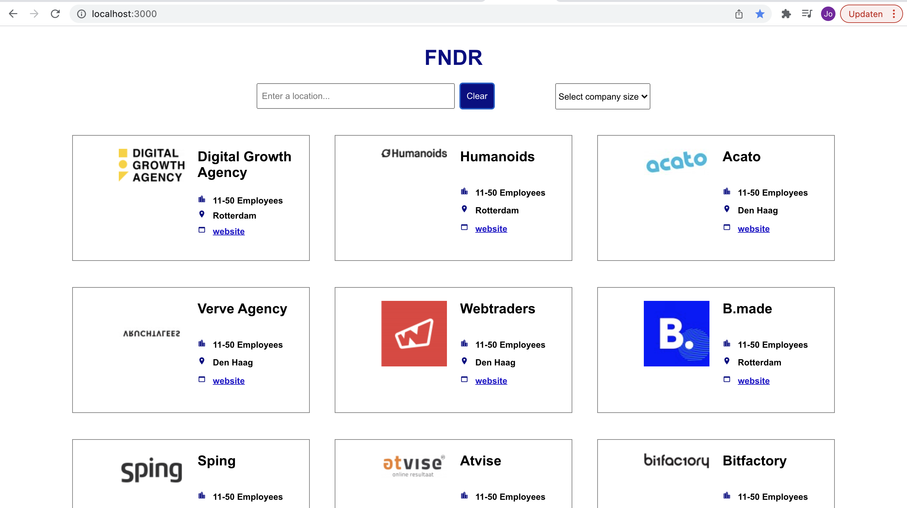

# FNDR - Find your Dutch digital agency in the FNDR-app.



## Continuous deployment

FNDR lives [here](https://fndr.netlify.app/).

## [React Application](https://github.com/facebook/create-react-app) using the following dependencies

- [axios](https://www.npmjs.com/package/axios)
- [json-server](https://www.npmjs.com/package/json-server)
- [concurrently](https://www.npmjs.com/package/concurrently)
- [react-loader-spinner](https://www.npmjs.com/package/react-loader-spinner)
- [react-icons](https://www.npmjs.com/package/react-icons)
- [lodash.debounce](https://www.npmjs.com/package/lodash.debounce)
- [react-router-dom v6](https://www.npmjs.com/package/react-router-dom)
- [react-helmet-async](https://www.npmjs.com/package/react-helmet-async)
- [react-snap](https://www.npmjs.com/package/react-snap)

Script:

```
npm install
```

This will install all required dependencies for this app.

## Create .env file (or copy .env.dist file)

Create 2 variables and insert your endpoint for development and production:

```
REACT_APP_DEV_MODE= (localhost)
REACT_APP_PRO_MODE= (backendserver)
```

## How to use the json.server?

Script:

```
npm run dev
```

This will start the json server and "npm start" simultaniously.
The react app will run on localhost:3000 and the json server will run on localhost:8000.
